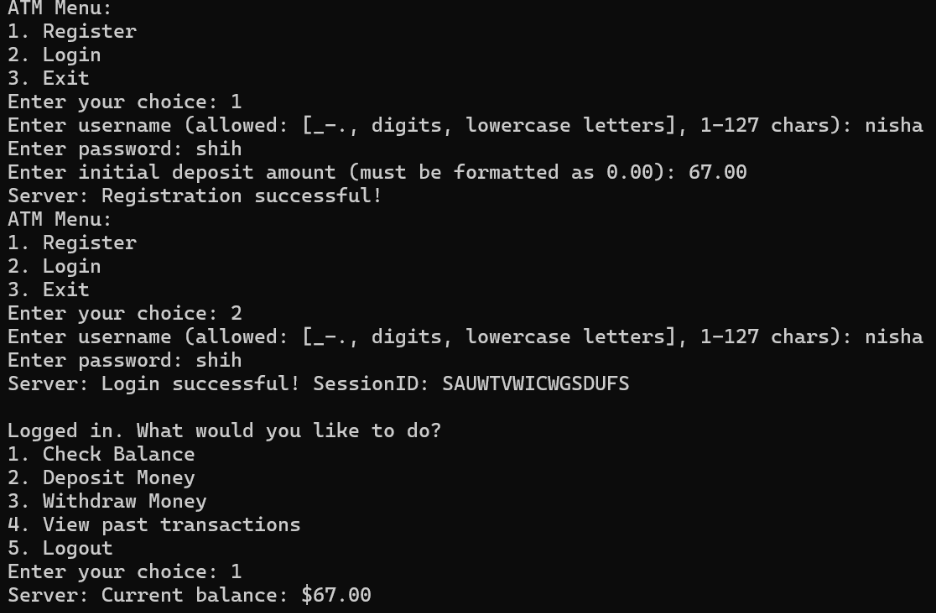

# Computer and Network Security Project: Secure Banking Communication Bank-ATM Model
In this project, we have aimed to create a Bank-ATM network and security model. The model consists of two C++ programs: the bank (which acts as the server) and the ATM (which acts as the client). The ATM program allows customers to interactively perform operations such as account creation, deposits, withdrawals, balance checks and view transaction history. The bank server handles the requests received from the atm using a database that stores the relevant information of registered users. The communication between the bank and the ATM happens over a secure network. Various security aspects - confidentiality, integrity and authentication have been addressed in the model. The user interface looks like this:

At the ATM (client) side, the user is prompted to choose one of the following three options: 

1. Register (for a new account creation): 
Enter Username: If the username does not meet the specified requirements, the user will be asked to enter a new one and will continue to do so until a valid username is provided. 
Enter Password: the user inputs the password for their account.
Enter Initial Deposit amount: Here, the user enters the initial amount to be deposited in the bank. This amount should be greater than $10.00, otherwise an appropriate message is displayed on the atm side, and the user is prompted to select from the three options again. If the username already exists in the bank database, the response “Username already exists” is displayed and the user  is prompted to select from the three options again.

---

2. Login (for existing users) - The server checks the username and password (hash). If they match, the bank generates a session ID using generate_session_id() and stores it in the active_sessions map. Response: "Login successful! SessionID: <id>" or "Invalid username or password!"
If the username and password do not match, the bank sends the response: “Invalid Username or Password”. Once a registered user has successfully logged in, a unique session ID gets generated, active for the entire duration that the user stays logged in. The user then gets prompted to choose one of the following options: 
* Check account balance - The session ID is sent along with the command to check balance to the bank, and the server responds with the user's current balance.
* Deposit money - The user enters an amount to deposit, and this is sent to the server along with the session ID. The server updates the balance and sends back the new balance. The user input also gets validated before the request is sent to the server (i.e., if the entered value is numeric, non-negative, etc).
* Withdraw money - Similar to deposit, the user enters an amount to withdraw. The bank checks if there are enough funds, then deducts the amount from the balance and sends back the updated balance. The user input also gets validated before the request is sent to the server.  If the transaction would result in a negative balance, an appropriate message is displayed on the ATM side, and the transaction is canceled.
* View past transactions (additional functionality) - The user can check the past transactions made along with the timestamps of the transactions using this option. The bank logs the transaction history of active users in a separate csv file. It retrieves the information from that file upon receiving this request.
* Logout (terminate the session) - The session is terminated, and the user is again prompted to choose from register, login and exit.
  
---

3. Exit: This option is used  to close the application and exit the program.
---
Our model has the following functionalities corresponding to the requirements of the project:
1. A unique username and password for each registered user - the ‘card file’ of each user contains this information. We have assumed that each valid user is in possession of this information, and they can choose to share it with anyone.
2. Auth file: This is the primary means of authentication between the ATM and the bank. When the bank program starts, the bank generates an authorization file. This file is also present with all authentic clients (ATM) through a secure channel (assumed to have been done already). So when the client tries to connect with the server, it will send its own auth file to the server. If it matches with the server’s file, the authentication is successful. This way, only recognised ATM programs will be able to connect to the server, unless the auth file gets compromised. In addition, we have also implemented a mutual authentication process using digital certificates for both the bank and the ATM, issued and verified by a certificate authority (explained in detail later). 
3. Functionality corresponding to the command “-n <balance>” (Create a new account with the given balance): The user can use the option of “Register” to create a new account with an initial deposit amount. 
4. Functionality corresponding to the command “-d <amount>” (Deposit the amount of money specified): Once a registered user has logged in, they can use the “deposit money” option to do the same in our model.
5. Functionality corresponding to the command “-w <amount>” (Withdraw the amount of money specified): Once a registered user has logged in, they can use the “withdraw money” option to do the same in our model.
6. Functionality corresponding to the command “-g” (Get the current balance of the account): Once a registered user has logged in, they can use the “check balance” option to do the same in our model.
7. Functionality corresponding to the SIGTERM signal (to terminate the ATM application): For a user who has an active session going on, they can use the ‘logout’ option to end the session to go back to the three original options (register, login or exit). Then, selecting ‘exit’ will terminate the ATM application
8. -p <port>: We are using the port to establish a connection between the bank server and the ATM.

##Configuring the ATM-Bank Model

Follow these steps to configure the ATM-Bank model:

1. Download the Build Folder: This folder contains the Makefile for macOS and Ubuntu, the C++ codes for the ATM and Bank, and a requirements folder with necessary files to run the codes successfully.
2. Compile the Code: Use the Makefile to compile atm_final and bank_final to create the executable files atm and bank, respectively.
3. Configure Server IP: Store the IP address of the machine running the Bank in server_ip.txt. Ensure that port 8080 is available for the Bank to operate.
4. Run the Bank: Start the Bank executable with the command: ./bank
5. This will generate an authentication key, which will be stored in bank_auth_file.txt. Copy this key and paste it into atm_auth_file.txt (assumption - this communication/exhange is considered secure).
6. Run the ATM: Now, execute the ATM with the command: ./atm

Voila! You are now in the ATM interface, ready to use the ATM-Bank model.

